# Custom AI Models & Bot Model Binding — Architectural Design & Implementation Plan

## 1. Executive Summary & Objectives

The goal is to extend the platform so that:
1. **User-Defined AI Models**: Users can register and configure their own AI models (e.g. self-hosted Ollama, remote vLLM, OpenAI, Groq, or custom OpenAI-compatible endpoints) with custom endpoint URLs, credentials, context windows, and inference defaults.
2. **Optional Bot-Level Model Binding**: When creating or updating an AI Bot (`POST /api/v1/bots` and `POST /api/v1/bots/with-documents`), the model selection (`model_id`, `temperature`, `top_p`, `max_tokens`) is **optional**:
   - If provided: The bot is bound to that specific AI model with the specified or inherited parameters.
   - If omitted: The bot automatically falls back to system default settings (`settings.LLM_PROVIDER` and `settings.VLLM_DEFAULT_MODEL`).
3. **Dynamic LLM Execution**: During chat, [`ChatService`](file:///Users/vivek/tatatel/chat-agent-bots-apis/app/services/chat_service.py) dynamically executes against the model's configured endpoint and credentials rather than being hardcoded to a single global endpoint.

---

## 2. Current Architecture vs. Target State

| Dimension | Current State | Target State |
|---|---|---|
| **Model Ownership** | [`AIModel`](file:///Users/vivek/tatatel/chat-agent-bots-apis/app/models/ai_model.py#L21) has no `user_id`; only global models exist. | [`AIModel`](file:///Users/vivek/tatatel/chat-agent-bots-apis/app/models/ai_model.py#L21) has optional `user_id`. System models have `user_id = NULL`; users own custom models. |
| **Model Credentials & Endpoint** | Model has optional `endpoint_url`, but no `api_key` column; custom endpoints are not invoked. | Model stores `endpoint_url` and optional `api_key` / auth headers. Supported by provider factory. |
| **Bot Creation API** | [`BotCreateRequest`](file:///Users/vivek/tatatel/chat-agent-bots-apis/app/schemas/bot.py#L63) does NOT accept `model_id` or model parameters. Requires separate `PUT /api/v1/models/bots/{bot_id}`. | [`BotCreateRequest`](file:///Users/vivek/tatatel/chat-agent-bots-apis/app/schemas/bot.py#L63) accepts optional `model_id`, `temperature`, `top_p`, `max_tokens`. |
| **Fallback Handling** | Hardcoded inside `chat_service.py` with fallback to `VLLM_DEFAULT_MODEL`. | Unified fallback: automatically resolves to the system default model during bot creation or chat execution. |
| **Bot Response Schema** | [`BotDetailResponse`](file:///Users/vivek/tatatel/chat-agent-bots-apis/app/schemas/bot.py#L239) does not include attached model details. | [`BotDetailResponse`](file:///Users/vivek/tatatel/chat-agent-bots-apis/app/schemas/bot.py#L239) includes `primary_model` summary (display name, model key, provider, temperature, etc.). |
| **Provider Execution** | Global singleton [`OpenAICompatibleProvider`](file:///Users/vivek/tatatel/chat-agent-bots-apis/app/ai/llm/provider.py#L71) bound only to `VLLM_BASE_URL`. | Dynamic connection factory: pools and routes requests to the model's custom `endpoint_url` and `api_key`. |

---

## 3. End-to-End Architectural Flow

```mermaid
flowchart TD
    subgraph ModelRegistration ["1. User Defines Custom Model (Optional)"]
        UserReg[User: POST /api/v1/models] --> ModelService[AIModelService.create]
        ModelService --> SaveModel[(Save to ai_models with user_id & endpoint_url)]
    end

    subgraph BotCreation ["2. User Creates Bot (POST /api/v1/bots)"]
        UserBot[User: POST /api/v1/bots] --> CheckModel{model_id provided?}
        
        CheckModel -- Yes --> ValidateModel[Validate model exists, active, & accessible]
        ValidateModel --> AttachConfig[Create BotModelConfig: is_primary=True]
        
        CheckModel -- No --> FallbackDefault[Fallback: Resolve System Default Model]
        FallbackDefault --> AttachDefault[Attach System Default BotModelConfig]
        
        AttachConfig --> SaveBot[(Save Bot & Config in DB)]
        AttachDefault --> SaveBot
    end

    subgraph ChatExecution ["3. Chat Invocation (POST /api/v1/chat)"]
        ChatReq[User Message] --> ChatServ[ChatService.chat]
        ChatServ --> FetchConfig[Fetch primary BotModelConfig]
        
        FetchConfig --> HasConfig{Model Config Exists?}
        HasConfig -- Yes --> LoadModel[Load model: provider, endpoint_url, model_key]
        HasConfig -- No --> LoadDefaultModel[Load system default model]
        
        LoadModel --> ProviderFactory[LLMProviderFactory.get_provider_for_model]
        LoadDefaultModel --> ProviderFactory
        
        ProviderFactory --> LLMClient[OpenAICompatibleProvider: target endpoint]
        LLMClient --> LangGraph[LangGraph Execution]
        LangGraph --> ChatResponse[Stream / Return Response to User]
    end
```



---

## 4. Detailed Component Design

### 4.1 Database Layer Changes

#### A. Migration: Add User Ownership & Credentials to `ai_models`
- **Table**: `ai_models`
- **New Columns**:
  - `user_id: UUID | None` (Foreign Key `users.id` with `ON DELETE SET NULL`, indexed).
    - `NULL` = System-wide model available to all tenants/users.
    - Set = Private model created by that user.
  - `api_key: String(255) | None` (Encrypted or masked API key for external providers e.g. OpenAI / Groq / OpenRouter).
  - `default_temperature: Float | None` (Default: `0.7`).
  - `default_top_p: Float | None` (Default: `1.0`).
  - `default_max_tokens: Integer | None` (Default: `2048`).
- **Constraint Update**:
  - Update `UniqueConstraint("provider", "model_key")` to allow different users to register their own instances of models (e.g. `(user_id, provider, model_key)`).

#### B. `bot_model_configs`
- Already supports `bot_id`, `model_id`, `temperature`, `top_p`, `max_tokens`, `config`, `is_primary`.
- No schema changes needed for `bot_model_configs`; only query and eager-loading optimizations.

---

### 4.2 API & Schema Enhancements

#### A. AI Model Schemas ([`app/schemas/ai_model.py`](file:///Users/vivek/tatatel/chat-agent-bots-apis/app/schemas/ai_model.py))
- **`AIModelCreate`**:
  ```python
  class AIModelCreate(BaseModel):
      provider: str = Field(..., min_length=2, max_length=50, examples=["vllm", "ollama", "openai", "groq", "custom"])
      model_key: str = Field(..., min_length=1, max_length=255, examples=["llama3.2:latest", "gpt-4o", "mistral-7b"])
      display_name: str = Field(..., min_length=2, max_length=255)
      model_type: Literal["chat", "embedding", "reranker"] = "chat"
      endpoint_url: str | None = Field(default=None, description="Custom base URL, e.g. http://localhost:11434/v1")
      api_key: str | None = Field(default=None, description="Optional API key for authorization")
      context_window: int | None = Field(default=None, ge=1)
      capabilities: dict[str, Any] = Field(default_factory=dict)
      default_temperature: float = Field(default=0.7, ge=0.0, le=2.0)
      default_top_p: float = Field(default=1.0, gt=0.0, le=1.0)
      default_max_tokens: int = Field(default=2048, ge=1, le=131072)
  ```
- **`AIModelResponse`**: Returns model metadata, with `api_key` masked (`sk-...xxxx`) or excluded.

#### B. Bot Schemas ([`app/schemas/bot.py`](file:///Users/vivek/tatatel/chat-agent-bots-apis/app/schemas/bot.py))
- **`BotCreateRequest`**:
  ```python
  class BotCreateRequest(BotBase):
      ...
      # Optional AI Model selection & configuration overrides
      model_id: uuid.UUID | None = Field(
          default=None,
          description="Optional AI Model ID. If omitted, falls back to platform default model."
      )
      temperature: float | None = Field(default=None, ge=0.0, le=2.0)
      top_p: float | None = Field(default=None, gt=0.0, le=1.0)
      max_tokens: int | None = Field(default=None, ge=1, le=131072)
      model_config_extra: dict[str, Any] = Field(default_factory=dict)
  ```
- **`BotUpdateRequest`**:
  ```python
  class BotUpdateRequest(BaseModel):
      ...
      # Optional model update
      model_id: uuid.UUID | None = None
      temperature: float | None = None
      top_p: float | None = None
      max_tokens: int | None = None
  ```
- **`BotDetailResponse`**:
  ```python
  class BotDetailResponse(BotResponse):
      versions: list[BotVersionResponse] = Field(default_factory=list)
      primary_model: BotModelConfigResponse | None = None
  ```

---

### 4.3 Service Layer Logic

#### A. Model Listing & Ownership Enforcement ([`AIModelService`](file:///Users/vivek/tatatel/chat-agent-bots-apis/app/services/ai_model_service.py))
- `list()` filters:
  ```python
  or_(AIModel.user_id == current_user.id, AIModel.user_id.is_(None))
  ```
  Users see both their custom registered models and platform-wide shared models.
- `get_accessible_model(model_id, user_id)`: Ensures a user cannot bind a bot to another tenant's private model.

#### B. Bot Creation & Fallback Resolution ([`BotService.create`](file:///Users/vivek/tatatel/chat-agent-bots-apis/app/services/bot_service.py))
```python
# 1. Create bot core record & initial bot version
bot = await BotRepository.create(...)

# 2. Resolve Model Binding:
if model_id:
    # Explicit user choice
    model = await ai_model_service.get_accessible(db, model_id=model_id, user_id=user_id)
    if not model or not model.is_active:
        raise ValidationException("Selected AI Model is invalid or inactive.")
    
    await AIModelRepository.create_bot_config(
        db,
        bot_id=bot.id,
        model_id=model.id,
        temperature=temperature if temperature is not None else getattr(model, "default_temperature", 0.7),
        top_p=top_p if top_p is not None else getattr(model, "default_top_p", 1.0),
        max_tokens=max_tokens if max_tokens is not None else getattr(model, "default_max_tokens", 2048),
        config=model_config_extra or {},
        is_primary=True,
    )
else:
    # Fallback to default platform model
    default_model = await ai_model_service.get_or_create_default_model(db)
    await AIModelRepository.create_bot_config(
        db,
        bot_id=bot.id,
        model_id=default_model.id,
        temperature=0.7,
        top_p=1.0,
        max_tokens=2048,
        is_primary=True,
    )
```

#### C. Bot Creation With Documents ([`BotService.create_with_documents`](file:///Users/vivek/tatatel/chat-agent-bots-apis/app/services/bot_service.py#L490))
- Accepts `model_id`, `temperature`, `top_p`, `max_tokens` from form data and forwards them to `self.create(...)`.

---

### 4.4 Dynamic Multi-Model LLM Execution ([`app/ai/llm/provider.py`](file:///Users/vivek/tatatel/chat-agent-bots-apis/app/ai/llm/provider.py))

Currently, `get_llm_provider()` is a static singleton pointing to `settings.VLLM_BASE_URL`.
We introduce a cached provider factory:

```python
_provider_cache: dict[str, LLMProvider] = {}

def get_llm_provider_for_model(model: AIModel | None = None) -> LLMProvider:
    """
    Returns an LLM provider configured specifically for the given AIModel.
    If endpoint_url or api_key are provided on the model, dynamically connects to that endpoint.
    Otherwise falls back to system settings (VLLM / Ollama defaults).
    """
    if not model or not model.endpoint_url:
        return get_llm_provider()

    cache_key = f"{model.provider}:{model.endpoint_url}:{model.api_key}"
    if cache_key not in _provider_cache:
        _provider_cache[cache_key] = OpenAICompatibleProvider(
            base_url=model.endpoint_url,
            api_key=model.api_key or "default-key",
            verify_ssl=settings.LLM_VERIFY_SSL,
            trust_env=settings.LLM_TRUST_ENV,
            no_proxy=settings.NO_PROXY or settings.no_proxy,
            timeout=settings.LLM_TIMEOUT_SECONDS,
        )
    return _provider_cache[cache_key]
```

In [`ChatService.chat()`](file:///Users/vivek/tatatel/chat-agent-bots-apis/app/services/chat_service.py#L368):
- Dynamically resolves the provider for the active bot model:
  ```python
  active_llm = get_llm_provider_for_model(model)
  ```
- Passes `active_llm` to [`ChatAgentGraph`](file:///Users/vivek/tatatel/chat-agent-bots-apis/app/ai/agent/graph.py).

---

## 5. Implementation Roadmap & Steps

1. **Phase 1: Database Migration**:
   - Create Alembic revision `add_user_id_and_credentials_to_ai_models.py`.
   - Update [`app/models/ai_model.py`](file:///Users/vivek/tatatel/chat-agent-bots-apis/app/models/ai_model.py) with `user_id`, `api_key`, and default parameter fields.
   - Run `alembic upgrade head`.

2. **Phase 2: Model Management & Security**:
   - Update [`AIModelRepository`](file:///Users/vivek/tatatel/chat-agent-bots-apis/app/repositories/ai_model_repository.py) to support `user_id` filtering and access verification.
   - Update [`AIModelService`](file:///Users/vivek/tatatel/chat-agent-bots-apis/app/services/ai_model_service.py) with `get_or_create_default_model()`.
   - Update [`app/schemas/ai_model.py`](file:///Users/vivek/tatatel/chat-agent-bots-apis/app/schemas/ai_model.py).

3. **Phase 3: Bot API Integration**:
   - Update [`BotCreateRequest`](file:///Users/vivek/tatatel/chat-agent-bots-apis/app/schemas/bot.py) and [`BotUpdateRequest`](file:///Users/vivek/tatatel/chat-agent-bots-apis/app/schemas/bot.py) with optional `model_id` and parameters.
   - Update [`BotService.create()`](file:///Users/vivek/tatatel/chat-agent-bots-apis/app/services/bot_service.py) and `update()` with fallback resolution.
   - Update `POST /api/v1/bots` and `POST /api/v1/bots/with-documents` in [`app/api/v1/bots.py`](file:///Users/vivek/tatatel/chat-agent-bots-apis/app/api/v1/bots.py).
   - Update [`BotDetailResponse`](file:///Users/vivek/tatatel/chat-agent-bots-apis/app/schemas/bot.py) to expose `primary_model`.

4. **Phase 4: Dynamic Provider Execution & Testing**:
   - Implement `get_llm_provider_for_model()` in [`app/ai/llm/provider.py`](file:///Users/vivek/tatatel/chat-agent-bots-apis/app/ai/llm/provider.py).
   - Integrate with [`ChatService`](file:///Users/vivek/tatatel/chat-agent-bots-apis/app/services/chat_service.py).
   - Create comprehensive unit/integration test covering:
     - Creating custom model with custom endpoint.
     - Creating bot with explicit custom model.
     - Creating bot without model (verifying fallback to default).
     - Executing chat with custom model.
