# High-Performance RAG Architecture & Concurrency Plan
### Scalable Searching, Concurrent Embeddings, Accurate Sources & Small Context Windows (100+ Documents)

---

## 1. Executive Summary & Root Cause Analysis

When a bot manages **100+ documents** (translating to 5,000 – 25,000+ chunks), the standard naive RAG approach fails across four critical dimensions:

```
┌────────────────────────────────────────────────────────────────────────────────────────┐
│                                 CURRENT BOTTLENECKS                                    │
├─────────────────────────┬─────────────────────────┬────────────────────────────────────┤
│ Ingestion Bottleneck    │ Retrieval Inaccuracy    │ Context Overflow on Small Models   │
├─────────────────────────┼─────────────────────────┼────────────────────────────────────┤
│ • Documents processed   │ • Pure dense vector     │ • Fixed top_k = 5 injects ~1000+   │
│   sequentially in a loop│   search misses exact   │   tokens regardless of model size. │
│ • Embeddings generated  │   keywords & codes.     │ • Small models (4k/8k context)     │
│   in serial batches     │ • Naive doc deduplication│   exhaust token budget, truncating │
│   (32 at a time).       │   artificially drops    │   conversation memory & output.    │
│ • Uploading 100 files   │   relevant chunks.      │ • Irrelevant padding causes model  │
│   takes 20-40+ minutes. │ • No cross-attention    │   distraction & hallucinations.    │
│                         │   reranking.            │                                    │
└─────────────────────────┴─────────────────────────┴────────────────────────────────────┘
```

### Objectives of this Architecture:
1. **10x Ingestion Acceleration**: Multi-threaded, asynchronous concurrent embedding & Qdrant batch upserts.
2. **Hybrid Search with RRF**: Parallel dense semantic search + lexical keyword search merged via Reciprocal Rank Fusion.
3. **High-Precision Reranking**: Cross-encoder / fast reranker to filter out noise so only verified, high-scoring snippets reach the LLM.
4. **Accurate Source Attribution**: Distinct file-level aggregation with exact page numbers, scores, and matched snippet excerpts.
5. **Budget-Aware Context Packing**: Dynamically scales injected context tokens to fit within small model context windows (2k, 4k, 8k tokens) without crowding out conversation history or generation space.

---

## 2. End-to-End System Architecture

```mermaid
flowchart TD
    subgraph IngestionPipeline ["A. Concurrent Ingestion & Embedding Pipeline"]
        Upload[100 Documents Uploaded] --> ChunkPool[Concurrent Extraction & Chunker]
        ChunkPool --> BatchQueue[Batch Formatter: 64 chunks/batch]
        
        subgraph ConcurrencyPool ["Multi-Worker Concurrency Pool"]
            Worker1[Async Worker 1: Embed Batch 1]
            Worker2[Async Worker 2: Embed Batch 2]
            Worker3[Async Worker 3: Embed Batch 3]
            Worker4[Async Worker 4: Embed Batch 4]
        end
        
        BatchQueue --> Worker1
        BatchQueue --> Worker2
        BatchQueue --> Worker3
        BatchQueue --> Worker4
        
        Worker1 --> QdrantUpsert[Parallel Batch Upsert to Qdrant]
        Worker2 --> QdrantUpsert
        Worker3 --> QdrantUpsert
        Worker4 --> QdrantUpsert
        QdrantUpsert --> QdrantDB[(Qdrant: Payload-Indexed Collection)]
    end

    subgraph RetrievalPipeline ["B. High-Precision Hybrid Search & Context Packing"]
        UserQuery[User Chat Query] --> ParallelSearch{Parallel Search Execution}
        
        ParallelSearch -->|Async Task 1| DenseVector[Dense Semantic Search: Cosine Top 30]
        ParallelSearch -->|Async Task 2| SparseLexical[Lexical / Keyword Match: Top 30]
        
        DenseVector --> RRFMerge[Reciprocal Rank Fusion - RRF]
        SparseLexical --> RRFMerge
        
        RRFMerge --> RerankerNode[Fast Reranker: Cross-Encoder / FlashRank]
        RerankerNode --> ConfidenceFilter{Confidence Threshold Gating}
        
        ConfidenceFilter -- High Relevance --> ContextPacker[Budget-Aware Context Packer]
        ConfidenceFilter -- Irrelevant Noise --> Dropped[Discarded from Context]
        
        ContextPacker --> ModelBudget[Token Budget: 25-30% of Model Window]
        ModelBudget --> FinalPrompt[PromptBuilder: Precision Snippets + Verified Sources]
        FinalPrompt --> LLM[Small Context LLM: llama3.2 / gemma-2b]
    end
```



---

## 3. Pillar 1: Multi-Threaded & Concurrent Embedding Pipeline

### 3.1 The Problem in Current Code
Currently, [`OllamaEmbeddingProvider.embed_documents`](file:///Users/vivek/tatatel/chat-agent-bots-apis/app/ai/llm/embeddings.py#L71) executes:
```python
for i in range(0, len(texts), batch_size):
    # Sequential HTTP request to Ollama /api/embed
    response = await client.post(...)
```
For 10,000 chunks from 100 documents, this generates **312 sequential roundtrips**, taking 15–30+ minutes while Ollama/vLLM and CPU cores sit mostly idle between requests.

### 3.2 Solution: Concurrency Pool with Bounded Semaphore & ThreadPool
1. **Async Bounded Semaphore**:
   - Create batches of 64 texts.
   - Dispatch multiple batches concurrently with `asyncio.Semaphore(max_concurrency=4)` (or configurable via `settings.EMBEDDING_CONCURRENCY`).
   - Allows the embedding server (Ollama / vLLM / Text-Embeddings-Inference) to saturate its batch GPU/CPU pipeline without exhausting connection sockets.
2. **Local CPU Embedding Multi-Threading**:
   - For local `sentence-transformers` / HuggingFace embeddings, offload tokenization and inference to a `ThreadPoolExecutor(max_workers=min(8, os.cpu_count()))` so the async event loop never freezes.
3. **Qdrant Payload Indexing & Batch Streaming**:
   - Before upserting, ensure Qdrant has payload indices on:
     - `user_id` (Keyword index)
     - `knowledge_base_id` (Keyword index)
     - `document_id` (Keyword index)
     - `text` (Full-text index with tokenizer)
   - Stream points to Qdrant in concurrent batches of 250 points with `wait=False`, syncing on completion.

---

## 4. Pillar 2: Hybrid Search & Reciprocal Rank Fusion (RRF)

### 4.1 Why Pure Dense Search Fails on 100 Documents
Pure dense vector search maps documents into semantic space. When there are thousands of chunks:
- **Lexical blindness**: Technical IDs, SKUs, product names, error codes, and specific section headers get blurred with semantically similar but factually incorrect passages.
- **Score compression**: Cosine distances between top candidates differ by less than 0.02, making rank order unpredictable.

### 4.2 The Hybrid Search Strategy
Run two parallel search streams concurrently using `asyncio.gather()`:
1. **Dense Vector Search**: Captures semantic intent, conceptual synonyms, and paraphrasing.
2. **Lexical Keyword / BM25 Search**: Matches exact keywords, entity names, numbers, and technical terms directly from Qdrant text index.

### 4.3 Reciprocal Rank Fusion (RRF)
Merge the ranked lists using the standard RRF algorithm:
$$RRF\_Score(d) = \sum_{m \in \{dense, lexical\}} \frac{1}{k + rank_m(d)}$$
*(where $k = 60$ is the standard smoothing constant).*

**Benefits**:
- Does not require calibrating or normalizing scores between vector cosine and BM25 scores.
- Documents that appear near the top of *both* dense and lexical search get an immediate boost.
- A document containing the exact keyword that vector search scored low will be rescued by lexical rank.

---

## 5. Pillar 3: Fast Reranking & Accurate Source Attribution

### 5.1 The Problem in Current Deduplication
In [`app/ai/rag/retrieval.py`](file:///Users/vivek/tatatel/chat-agent-bots-apis/app/ai/rag/retrieval.py#L358):
```python
# Current logic artificially limits chunks per document based on total matched docs
max_per_doc = max(1, limit // len(doc_ids) + 1)
```
If 15 documents match, `max_per_doc = 1`. If Document A contains 3 paragraphs that together answer the question, Document A is artificially throttled to 1 chunk, and 4 slots are handed to less relevant files.

### 5.2 The New Reranking & Source Pipeline
1. **Candidate Retrieval Pool**:
   - Retrieve `top 30` candidates from Hybrid RRF search.
2. **Fast Reranking Stage**:
   - Run a lightweight Cross-Encoder / FlashRank reranker (running in a background thread pool).
   - Computes cross-attention relevance score between `(query, chunk.text)` from $0.0$ to $1.0$.
3. **Relevance Gating**:
   - Apply a strict threshold: discard any candidate scoring $< 0.40$ (or configurable).
   - If only 2 chunks are genuinely relevant, return 2 chunks. Do not pad the LLM context with noise.
4. **Accurate Document-Level Source Aggregation**:
   - Group chunks by `document_id`.
   - Record:
     - `file_name`
     - `pages`: list of matching pages, e.g. `[2, 3, 7]`
     - `best_score`: highest rerank score achieved
     - `matched_snippets`: concise previews of the exact text segments used
     - `chunk_count`: number of supporting passages found in this file

---

## 6. Pillar 4: Small Model Context Window Strategy (Budget-Aware Packing)

### 6.1 The Challenge
Small models (e.g. `llama3.2:1b`, `llama3.2:3b`, `gemma-2:2b`, or models restricted to 2048 – 4096 tokens) cannot tolerate 2000+ tokens of raw RAG context without crowding out:
- System platform security rules (~250 tokens)
- Bot persona instruction (~200 tokens)
- Conversation memory & history (~500 tokens)
- Output generation space (~1000 tokens)

### 6.2 The Solution: Dynamic Context Budgeting

```
Total Context Window (e.g., 4096 tokens)
├───────────────────────────────────────────┤
│ System & Bot Instructions:    ~400 tokens │
│ Conversation History & Memory: ~600 tokens│
│ Max Generation Reserve:       ~1500 tokens│
│ Dynamic RAG Context Budget:   ~1200 tokens│ ◄── STRICT CEILING
└───────────────────────────────────────────┘
```

1. **Model-Aware Budget Calculation**:
   $$\text{RAG\_Token\_Budget} = \min(1500, \text{int}(\text{model\_context\_window} \times 0.30))$$
2. **Dense Chunking**:
   - Reduce default chunk size from 800 characters to **450–500 characters** with **60-character overlap**.
   - Smaller chunks produce significantly higher vector density and fewer irrelevant surrounding sentences.
3. **Greedy Priority Packing**:
   - Sort reranked chunks by score descending.
   - Accumulate chunks until the `RAG_Token_Budget` is reached. Stop immediately.
   - Any chunk that exceeds the remaining budget is omitted, guaranteeing the prompt never overflows.

---

## 7. Implementation Roadmap & Milestones

### Phase 1: Embedding Concurrency & Qdrant Payload Indexing
- [ ] Add `EMBEDDING_CONCURRENCY` to [`app/config.py`](file:///Users/vivek/tatatel/chat-agent-bots-apis/app/config.py).
- [ ] Refactor [`OllamaEmbeddingProvider`](file:///Users/vivek/tatatel/chat-agent-bots-apis/app/ai/llm/embeddings.py) to use `asyncio.gather` with bounded semaphore.
- [ ] Update [`ensure_collection`](file:///Users/vivek/tatatel/chat-agent-bots-apis/app/integrations/qdrant.py) to create payload indices on `user_id`, `knowledge_base_id`, `document_id`, and full-text index on `text`.
- [ ] Update [`VectorStoreService.upsert_chunks`](file:///Users/vivek/tatatel/chat-agent-bots-apis/app/ai/rag/vector_store.py) to stream concurrent batch upserts.

### Phase 2: Parallel Ingestion for Bulk Documents
- [ ] Refactor [`BotService.create_with_documents`](file:///Users/vivek/tatatel/chat-agent-bots-apis/app/services/bot_service.py#L570) to ingest files concurrently using `asyncio.gather(semaphore)` instead of a blocking sequential loop.
- [ ] Ensure Celery workers process multiple document tasks in parallel.

### Phase 3: Hybrid Search (Dense + Lexical) & Reciprocal Rank Fusion
- [ ] Add payload text search method to [`VectorStoreService`](file:///Users/vivek/tatatel/chat-agent-bots-apis/app/ai/rag/vector_store.py).
- [ ] Implement parallel dual-search in [`RetrievalService`](file:///Users/vivek/tatatel/chat-agent-bots-apis/app/ai/rag/retrieval.py) (`asyncio.gather`).
- [ ] Implement RRF fusion algorithm merging dense + lexical candidate lists.

### Phase 4: Fast Reranking & Source Deduplication Overhaul
- [ ] Replace naive `max_per_doc` logic in `_deduplicate()` with score-weighted relevance gating.
- [ ] Integrate fast reranking scorer to eliminate low-confidence chunks.
- [ ] Build distinct source response objects with accurate multi-page listings and snippet highlights.

### Phase 5: Budget-Aware Context Packing in PromptBuilder
- [ ] Update [`PromptBuilderService`](file:///Users/vivek/tatatel/chat-agent-bots-apis/app/ai/llm/prompt_builder.py) to accept `max_rag_tokens` (derived from model configuration).
- [ ] Implement greedy budget packing to guarantee small context window models are never overloaded.
- [ ] Verify end-to-end performance on 100 documents.
